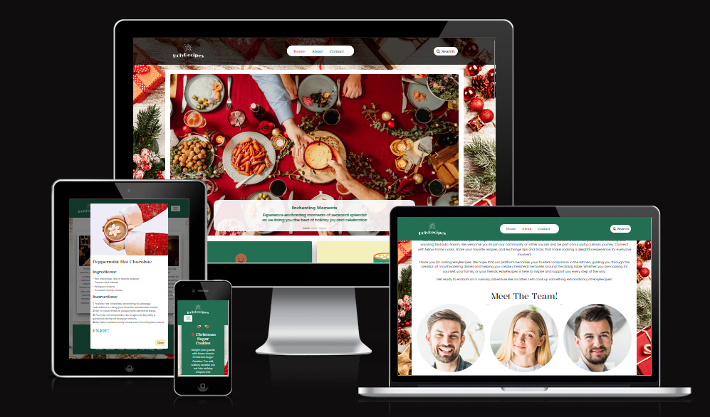
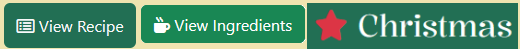
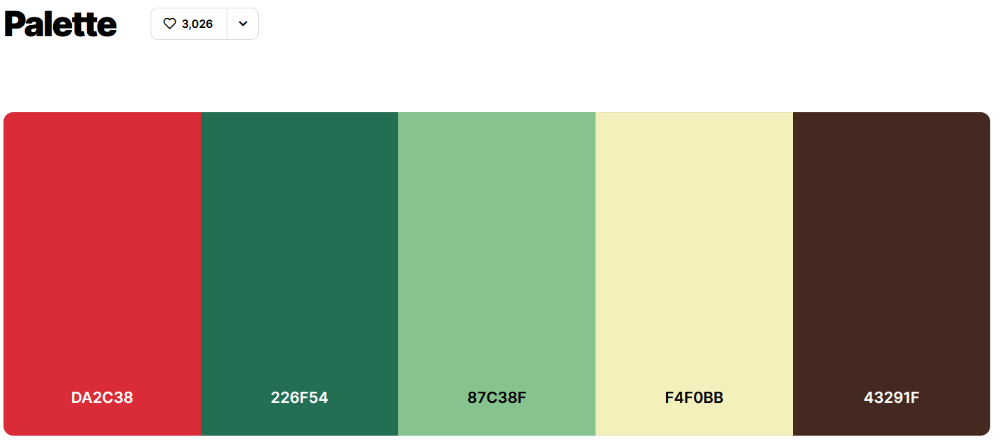
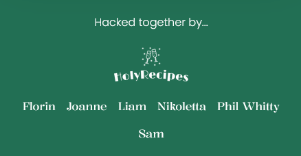
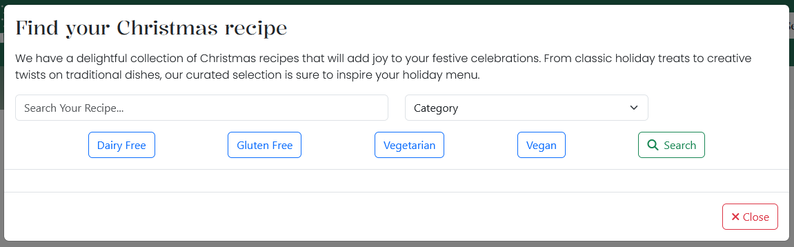
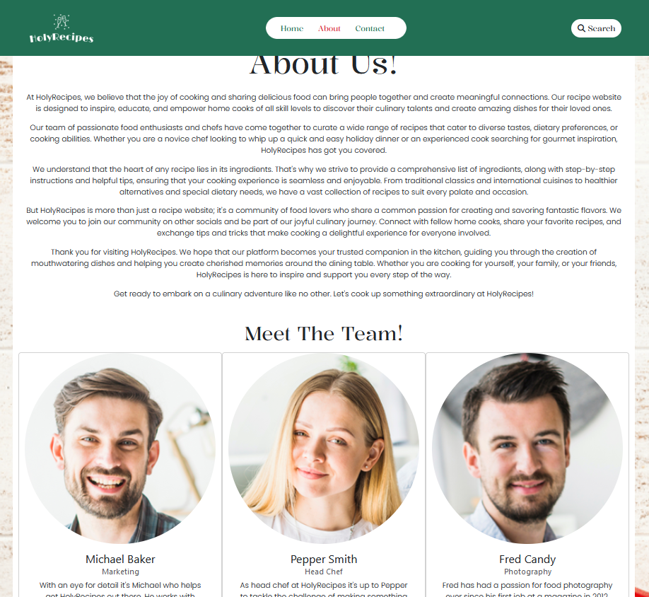
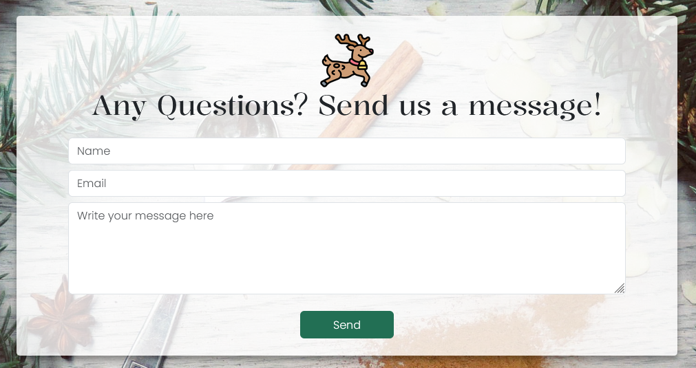
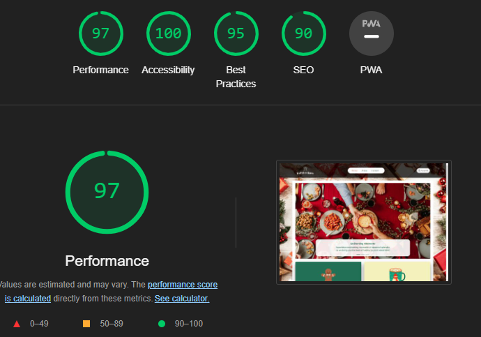

  

[Holy Recipe](https://xttrust.github.io/HolyRecipes/) is a virtual kitchen, we understand that the heart of any holiday celebration is the joy of preparing and sharing delicious meals with loved ones. Our website is a festive hub where culinary enthusiasts, whether seasoned chefs or those taking their first steps in the kitchen, can find inspiration for creating memorable Christmas feasts

## Table of Contents

1.  

        
<a href="#ux">UX</a>

      <ul>
      <li>

      
<a href="#goals">Goals</a>

      - [Visitor Goals](#visitor-goals)
      - [User Stories](#user-stories)
      
</li>

      <li>

      
<a href="#visual-design">Visual Design</a>

      - [Wireframes](#wireframes)
      - [Fonts](#fonts)
      - [Icons](#icons)
      - [Colors](#colors)
      
</li>
      </ul>

    

2.  

        
<a href="#features">Features</a>

      <ul>
      <li>

      
<a href="#page-elements">Page Elements</a>

      - [All Pages](#all-pages)
      - [Index Page](#index-page)
      - [About Page](#about-page)
      - [Contact Page](#contact-page)
      
</li>

      <li>

      
<a href="#feature-ideas">Feature Ideas</a>

      - [Basic](#basic)
      - [Content](#content)
      
</li>
      </ul>

    

3.  

        
<a href="#technologies-used">Technologies Used</a>

      - [Languages](#languages)
      - [Frameworks](#frameworks)
      - [Libraries](#libraries)
      - [APIs](#apis)
      - [Platforms](#platforms)
      - [Other Tools](#other-tools)

    

4.  

        
<a href="#testing">Testing</a>

      <ul>
      <li>

      
<a href="#methods">Methods</a>

      - [Validation](#validation)
      - [Manual Testing](#manual-testing)
      
</li>

      <li>

      
<a href="#bugs">Bugs</a>

      - [Known Bugs](#known-bugs)
      - [Fixed Bugs](#fixed-bugs)
      
</li>
      </ul>

    

5. <a href="#deployment">Deployment</a>

6.  

        
<a href="#credits">Credits</a>

      - [Images](#images)
      - [Writing](#writing)
      
    

7. <a href="#contributors">Contributors</a>

---

# UX

## Goals

### Visitor Goals

User goals are:

- Elevate your holiday celebrations with a variety of festive dishes.
- Boost confidence, whether you're a seasoned chef or kitchen novice.
- Add innovation and surprise to your holiday feast.
- Contribute recipes, exchange tips, and inspire others such as family and friends.
- Create a festive meal even with time constraints.

### User Stories

1. As a user, I want to easily browse and find diverse Christmas recipes on the website to enhance my holiday celebrations with a variety of festive dishes.
2. As a user, I want clear and concise step-by-step instructions for each recipe, regardless of my cooking expertise, to navigate holiday cooking with confidence.
3. As a user, I want a section showcasing unique and innovative Christmas recipes to inspire creativity and add a special touch to my holiday feast.
4. As a user, I want a dedicated section featuring quick and easy holiday recipes, allowing me to prepare a festive meal even when short on time

## Visual Design

### Wireframes

Wireframes: To see the wireframes created at the UX stage [Click Here!](https://github.com/xttrust/HolyRecipes/tree/main/wireframes)

### Fonts

  

  

- The primary font, [Kalnia](https://fonts.google.com/specimen/Kalnia) was chosen because it instantly gives a more festive feel than what you may normally see on the web due to it going against the grain and being more decorative with a serif. This is more inline witth other festive designs around at this time of year giving it a holiday recognisability
- The secondary font, [Poppins](https://fonts.google.com/specimen/Poppins) was chosen because it possesses increased readability over style while giving the page a very clean and professional look allowing the user to trust the content they are reading has merit.

### Icons

  

- Icons are taken from the [Fontawesome](https://fontawesome.com/) Icon library and are utilised as classes in the `<i>` tag.
- As they are utilised as classes, they can easily be styled using other classes or IDs in the same tag. I often used Bootstrap classes to style them uniformly.
- Icons are utilised as decoration for the page, adding flair to buttons that convey meaning as to their purpose secondary to the text description, an icon is often recognised quicker than what we read so this give a more fluid user experience when navigating the site

### Colors

  

- The primary goal of this colour palette was to give instant recognition to holiday colours we are all very familiar with, the second colour christmas tree green was used for the main navigation areas of the site (NavBar, Footer). 
- The other colours were all used decorateively in other areas as the holidays are a colourful time of year, santa red was used as a hover effect on buttons to clearly display they were interactive to the user and the more muted green was used for as a link hover to clearly display to the user when they could interact with site.

---

# Features

## Page Elements

### All Pages

#### Navbar

  
  

- The Navbar is simple, providing only four options, the home page so the user can always access the landing page if they wish, an about page detailing the origin and expertise of HolyRecipes, a contact page if the user has any needs they want to convery to HolyRecipes and a search box so the user can look for all the recipes on the sites using any parameter they wish
- The Logo is always highlighted, swapping size as necessary depending on device size.
- On smaller devices, the menu becomes collapsible.
- The mobile nav button has been placed to the right for ease of use with one hand.
- The navbar is fixed so it is visible no matter how far you scroll.

#### Footer

  
  

- Located at the bottom of every page, highlighting the creators of the site
- Made of three columns, changing shape for larger or smaller devices.
- The first column has a bit of descriptive text
- The site logo is in the second column
- The third column represents Github links of the sites creators

#### Searchbox

  

- A comprehensive search box using [Edamam Recipe API](https://developer.edamam.com/edamam-docs-recipe-api-v1) when clicked it brings up a modal with several categories of food, dietary filters and a search box. All results are in the modal with an option for the user to expand the recipe if they have further interest.

### Index Page

#### Carousel

  

- A simple carousel with bright festive images that grab the users attention as soon as they land on the page, the user can interact to see the sites other featured items

### About Page

  

- A simple about section describing the teams journey and expertise, there are bootstrap cards at the bottom describing the team members role and skills they bring to the site.

### Contact Page

  

- A friendly and welcoming page that invites questions and uses [EmailJS](https://www.emailjs.com/) to send the emails.
- The form has validation and is fully responsive.
- Once the send button is pressed, a message will appear letting the user know if the message is successful or has failed

## Feature Ideas

### Basic

- A random recipe button
- A way for users to save recipes for later
- A way for users to share recipes they like
- A way for users to upload their own content

### Content

- More recipes
- Video Guides

---

# Technologies Used

## Languages

- [HTML](w3.org/standards/webdesign/htmlcss)
  - Page markup.
- [CSS](w3.org/standards/webdesign/htmlcss)
  - Styling.
- [Javascript](https://developer.mozilla.org/en-US/docs/Web/JavaScript)
  - Running functions for interactive components, AJAX, etc.

## Frameworks

- [Bootstrap 5](https://getbootstrap.com/)
  - Used for basic styles and outline.

## Libraries

- [JQuery](https://jquery.com/)
  - Animations and click functions.
- [Google Fonts](https://fonts.google.com)
  - Font Styles.
- [Fontawesome](https://fontawesome.com/)
  - Used for icons

## APIs

- [Edamam Recipe API](https://developer.edamam.com/edamam-docs-recipe-api-v1)
  - Recipe API used for searchbox function
- [EmailJS](https://www.emailjs.com/)
   - EmailAPI used for having a contact page with no backend

## Platforms

- [Github](https://github.com/)
  - Storing code remotely and deployment.  
- [Gitpod](https://gitpod.io/)
  - IDE for project development.

## Other Tools

- [Balsamiq](https://balsamiq.com/)
  - To create wireframes.
- [Favicon Generator](https://www.favicon-generator.org/)
  - Favicons
- [Coolors](https://coolors.co/)
  - Creating color pallettes.

---

# Testing

## Methods

### Validation

- HTML has been validated with [W3C HTML5 Validator](https://validator.w3.org/).
- CSS has been validated with [W3C CSS Validator](https://jigsaw.w3.org/css-validator/)
- Links checked with [W3C Link Checker](https://validator.w3.org/checklink).

  

- Google Lighthouse tool was used to assess the web-site

### Manual Testing
**TEST** | **ACTION** | **EXPECTATION** | **RESULT** 
----------|----------|----------|----------
Index | Size to 320px by 800px using Chrome Dev Tools	| Elements look good @ 320px by 800px | Works as expected
Index | Size to 1920px by 1080px using Chrome Dev Tools | Elements look good 1920px by 1080px | Works as expected
About | Size to 320px by 800px using Chrome Dev Tools	| Elements look good @ 320px by 800px | Works as expected
About | Size to 1920px by 1080px using Chrome Dev Tools | Elements look good 1920px by 1080px | Works as expected
Contact | Size to 320px by 800px using Chrome Dev Tools	| Elements look good @ 320px by 800px | Works as expected
Contact | Size to 1920px by 1080px using Chrome Dev Tools | Elements look good 1920px by 1080px | Works as expected
Index page test | All phone sizes checked using Chrome Dev Tools | Elements look good | Works at expected
About page test | All phone sizes checked using Chrome Dev Tools | Elements look good | Works at expected
Contact page test | All phone sizes checked using Chrome Dev Tools | Elements look good | Works at expected

## Bugs

### Fixed Bugs

- One bug that occurred on our website was a lack of responsiveness. The website did not adjust its layout properly when accessed on different devices such as smartphones, tablets, or desktops. As a result, the content appeared incorrectly.  
However, this bug has now been fixed. The issue was media querys not being appropriately and correctly used due to a team members first use of them, this was later reviewed by a more experienced team member and resolved

---

## Deployment

- The site was deployed to GitHub pages. The steps to deploy are as follows:
  - In the GitHub repository, navigate to the Settings tab
  - From the source section drop-down menu, select the Master Branch
  - Once the master branch has been selected, the page will be automatically refreshed with a detailed ribbon display to indicate the successful deployment.

The live link can be found [HERE](https://xttrust.github.io/HolyRecipes/)

## Credits

#### Images

- Images of team on About Us page from <a href="https://www.freepik.com/free-photo/portrait-happy-male-female-businesspeople_2554804.htm#query=office%20team&position=6&from_view=search&track=ais&uuid=4574dab0-1db6-46d9-b877-074af12a0f27">Freepik</a>

- Images taken from <a href="https://www.pexels.com/">Pexels</a>

- Images taken from <a href="https://www.flaticon.com/">Flaticon</a>

- Images taken from <a href="https://www.canva.com/en_gb/">Canva</a>

#### Writing

- Recipes taken from <a href="https://www.taste.com.au/">www.taste.au</a>

- Recipes and website text created using <a href="https://chat.openai.com/">ChatGPT4</a>

## Contributors

- [Florin - Scrum Master](https://github.com/xttrust)
- [Joanne_CI](https://github.com/lee-joanne)
- [Liam](https://github.com/caleom)
- [Nikoletta](https://github.com/NikolettaGr)
- [Phil Whitty](https://github.com/phillywhitty)
- [Sam](https://github.com/sammartin92)

---
